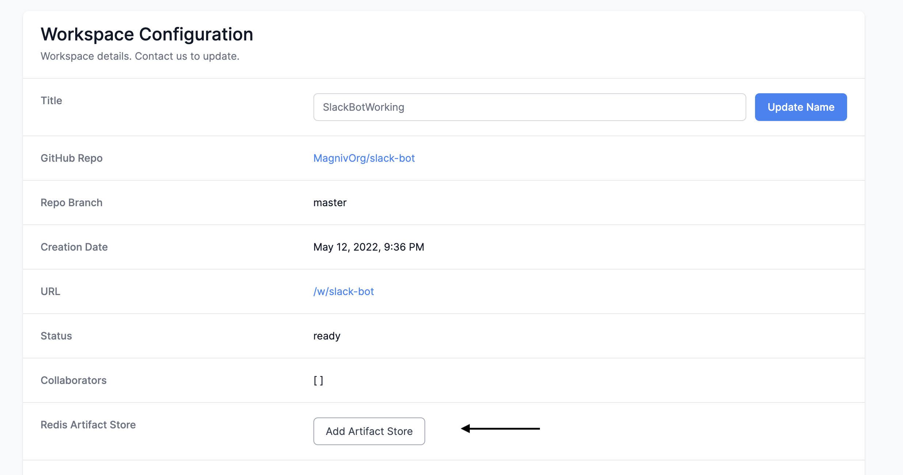
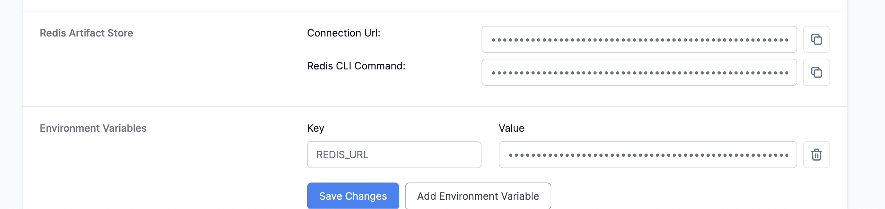

# Artifact Store


We now offer the ability to create a Redis instance on workspaces.

In the future we will roll out an integration with `magniv-core` this way you can keep track of different metadata for each task that accesses the artifact store.

:::info
Each provisioned Redis instance is 1 GB in size. If you need more please [let us know](mailto:hello@magniv.io?subject=Increase%20Redis%20Size). 
:::
___

## Adding a Redis instance

To add a Redis instance to your workspace first navigate to your config page and then click on `Add Artifact Store`:


The artifact store should take about 15 minutes to set up, once it is done you will recieve and email and your config page should look like this:


Magniv will automatically add the `REDIS_URL` environment variable.


## Connecting to Redis from a Magniv task

To connect to the Redis instance:

- First install Redis and add it to your `requirements.txt`
- Then connect using:
    - the [`from_url` option](https://redis-py.readthedocs.io/en/stable/connections.html?highlight=from_url#redis.Redis.from_url) in Redis
    - the environment variable `REDIS_URL` (be sure to add this locally as well)

Here is an example code snippet:
```python
from magniv.core import task
import redis
import os

@task(schedule='@daily')
def redis_test():
    r = redis.from_url(os.environ.get("REDIS_URL"))
    r.set("hello", "world")
    print(r.get("hello"))

```

And that is it! Be sure to check out [our tutorials](../tutorials) to see some use cases of an artifact store!
