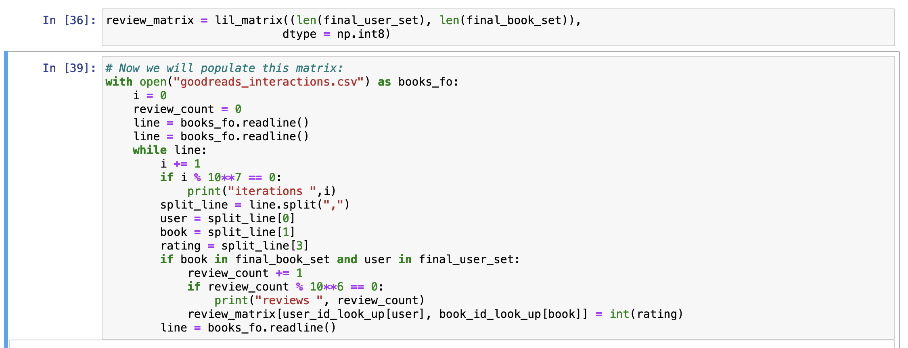
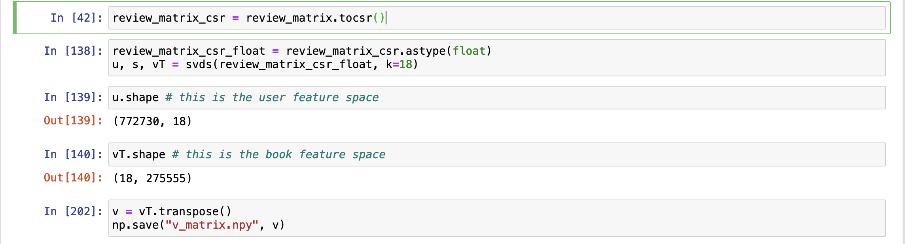
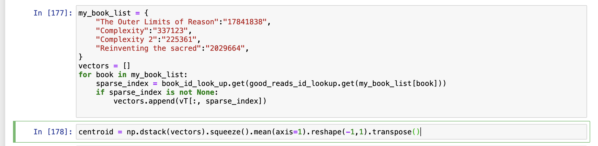
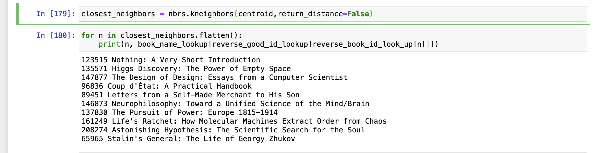
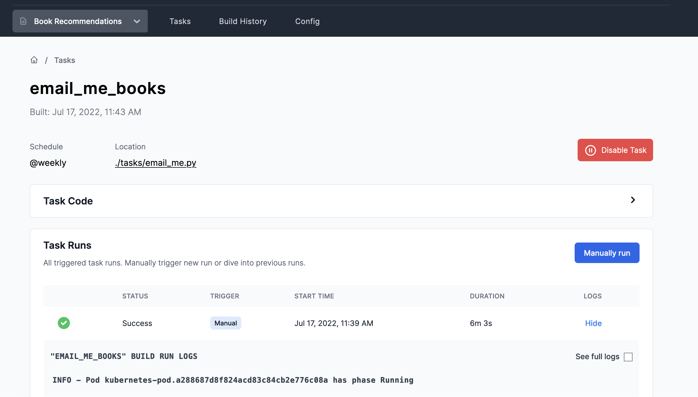

## Background

Books are great, especially books that open you up to new ideas. 

In this tutorial, we will use Magniv to deploy a model that will find us new book recommendations every week and send a list of them via email.

:::tip
The Jupyter notebook used to prepare this project can be [found here](https://github.com/MagnivOrg/book-recommender/blob/master/book.ipynb), and the rest of the code is available in [this repository](https://github.com/MagnivOrg/book-recommender).
:::

:::tip
A smaller interactive version of this can be found [on hex](https://app.hex.tech/d043b286-cb12-4f1a-9980-a64d29b84934/app/609be11f-73a3-4cd0-a484-bf10ba8d63a0/latest). 
:::

## Project Considerations

This tutorial is broken down into four major steps:
1. Build a rating matring from the Goodreads data
2. Use SVD to decompose the rating matring
3. Use the decomposition as embeddings and perform K-Nearest-Neighbors
4. Email myself new book recommendations every week and deploy model to Magniv

### STEP 1: Preparing the Goodreads Dataset

We will start with [this UCSD dataset](https://sites.google.com/eng.ucsd.edu/ucsdbookgraph/shelves) of Goodreads user book ratings from 2017.

The UCSD dataset is pretty large:
 - ~229m ratings
 - ~2.3m books
 - ~876k users

For memory, speed, and data cleaning reasons, let's keep only users with more than ten reviews and books with over 100 reviews. 

After cleaning, the dataset includes:
 - ~194m ratings
 - ~275k books
 - ~772k users

We then create a rating matring, which is a matrix where each entry corresponds to a user-book rating. In other words, the ijth entry is user i's rating of book j. The rating matring is created by reading through the dataset and updating the corresponding entries. 

The rating matring is huge (772k users by 275k books) but pretty sparse, so let's use `lil_matrix` from `scipy`, to conserve space. 



### STEP 2: Performing the Singular Value Decomposition

Inspired by the [winning submission to the Netflix Prize](https://datajobs.com/data-science-repo/Recommender-Systems-[Netflix].pdf) in 2009 (and also wanting to do some real math instead of deep learning), we will use a partial Singular Value Decomposition to decompose the rating matring and use the decomposition as embeddings.


We will spare you the details of SVD, but simply, SVD is a matrix decomposition of a matrix M into three matrices, U Σ and V. The matrices U Σ and V have some nice properties that make them useful in many different contexts. You can read more on [Wikipedia](https://en.wikipedia.org/wiki/Singular_value_decomposition).
<p align="center">

</p>

The SVD algorithm we are using from `scipy` is an approximation of SVD where we are allowed to choose a `k`. `k` is the size of the Σ matrix which also will be the dimension of the latent space. We picked `k=18`, but you can tune `k` to your liking. 

The resultant matrices U and V are of shape 772730 by 18 and 275555 by 18, respectively. 

We will interpret each row of these matrices as an embedding for each user and book in the dataset.

### STEP 3: Creating a Centroid Vector and Performing K Nearest Neighbors

Because we want book recommendations based on books that we have already read, all the predictor needs is the V matrix. We can view the V matrix as a series of vectors in 18 dimensional "book space". We can recommend a book by finding the closest vectors to a given vector in the book space. 

More concretely, let's take three of my favorite books on reason and logic:

1. The Outer Limits of Reason By Noson Yanofsky
2. Complexity By Mitchell Waldrop
3. Reinventing the Sacred By Stuart Kauffman

Let’s then calculate the centroid by taking the average of the vector representation of each book above. The centroid should be similar to other books that have similar features to the original books we chose.


We now run the centroid through a sklearn's KNN clustering algorithm and are given the closests books: 


Viola! Some pretty cool recommendations! Time to buy a few..

### STEP 4: Tying it Together and Deploying on Magniv

We have built a pretty good model with basically no effort! Now that we have saved the V matrix and a few other lookup tools, we can create a Magniv task that will run every week.

All the model work is done for the Magniv tasks. We will use the V matrix to find us recommendations and send us an email using Sendgrid. 

To get interesting and fun recommendations every week we will take a random subset of three books from our book list. I added a few fiction books to my list to add some variability in the recommendations. 

Here is the code we used for the Magniv task:
```python
from magniv.core import task
import os
import json
import random
import numpy as np
from sklearn.neighbors import NearestNeighbors
from sendgrid import SendGridAPIClient
from sendgrid.helpers.mail import Mail, To


@task(schedule="@weekly")
def email_me_books():
    # Pick three random books from my list of faviorite books
    my_book_list = json.load(open("./tasks/datas/my_book_list.json"))
    selected_books = random.sample(my_book_list, 3)
    recommended_books = _get_recommended_books(selected_books)
    _send_email("<br>- ".join(recommended_books), "<br>- ".join(selected_books))


def _send_email(recommended_books, selected_books):
    email_content = f"Hi<br><br>You new book recs are<br>- {recommended_books}<br>______<br>Taken from:<br>- {selected_books}<br>Enjoy"
    message = Mail(
        os.environ.get("FROM_EMAIL"),
        to_emails=[To(email=os.environ.get("TO_EMAIL"))],
        subject="Your Weekly Book Reccomendations",
        html_content=email_content,
    )

    try:
        sg = SendGridAPIClient(os.environ.get("SENDGRID_API_KEY"))
        response = sg.send(message)
    except Exception as e:
        print("pass ", e)


def _get_recommended_books(current_books):
    book_to_index = json.load(open("./tasks/datas/book_to_index.json"))
    index_to_book = json.load(open("./tasks/datas/index_to_book.json"))
    v_matrix = np.load("./tasks/datas/v_matrix.npy")
    book_names = list(book_to_index.keys())
    nbrs = NearestNeighbors(n_neighbors=8, algorithm="ball_tree").fit(v_matrix)
    selected_indexes = [book_to_index[book] for book in current_books]
    vectors = []
    for index in selected_indexes:
        vectors.append(v_matrix[int(index), :])
    recommended_books = []
    if len(vectors) > 0:
        centroid = np.dstack(vectors).squeeze().mean(axis=1).transpose().reshape(-1, 1)
        closest_neighbors = nbrs.kneighbors(centroid.transpose(), return_distance=False)
        for n in closest_neighbors.flatten():
            recommended_books.append(index_to_book[str(n)])
    return recommended_books


if __name__ == "__main__":
    email_me_books()
```


And here is my `my_book_list.json`:

```json
[
        "The Outer Limits of Reason: What Science, Mathematics, and Logic Cannot Tell Us",
        "Complexity: The Emerging Science at the Edge of Order and Chaos",
        "Reinventing the Sacred: A New View of Science, Reason, and Religion",
        "The Emperor's New Mind Concerning Computers, Minds and the Laws of Physics",
        "Shadows of the Mind: A Search for the Missing Science of Consciousness",
        "Antifragile: Things That Gain from Disorder",
        "The Enigma of Reason",
        "Thinking, Fast and Slow",
        "Good Natured - The Origins of Right & Wrong in Humans & Other Animals",
        "East of Eden",
        "The Age of Innocence",
        "Life of Pi",
        "Man Is Not Alone: A Philosophy of Religion",
        "Of Mice and Men",
        "The Four Agreements: A Practical Guide to Personal Freedom",
        "The Mastery of Love: A Practical Guide to the Art of Relationship --Toltec Wisdom Book",
        "The Art of Loving"
]
```
We then push it up to Github and create a workspace on Magniv:


And we are done:


## Recap

🎉 Congratulations! 

In this Book Recommendation tutorial, you:
1. Learned how to use SVD to represent a real dataset
2. Built a model using KNN to recommend similar books
3. Deployed the model and scheduled weekly email book recommendations using Magniv

## What's next?

This tutorial can be a template for many other recommendation systems and Magniv tasks. 

Let us know what you are building on Magniv by [tagging us](https://twitter.com/MagnivApp) on Twitter!

Be sure to check out [other tutorials](../tutorials)
