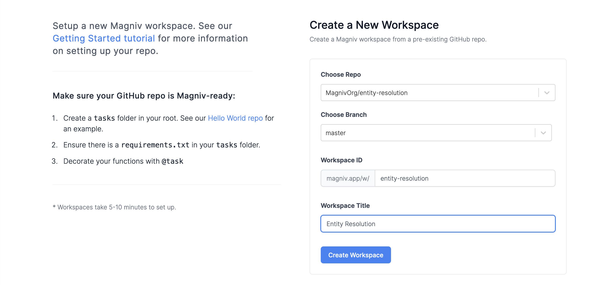
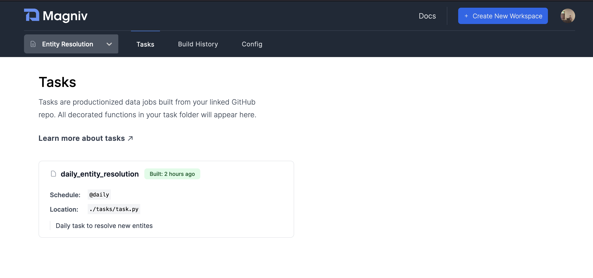

# Entity Resolution with Magniv

Entity resolution is the task of determining whether two or more records are referring to the same entity. This task is common for data science teams that have to deal with data that does not have a unique key.

Corporation names is one example where entity resolution can be necissary. A good model should be able to determine that the names:
- *Magniv* 
- *Magniv, Inc*
- *Magniv Incoperated* 

are all referring to the same entity.


In this tutorial we will be using a [dataset of college affiliations](https://dbs.uni-leipzig.de/research/projects/object_matching/benchmark_datasets_for_entity_resolution) taken from research papers. This example can be easily applied to other entity resolution scenarios. 

We will also create a toy scenario where we assume that we have a set of already matched affiliations and that every night we will have to match 10new affiliations that have been entered into the system.

The code for this tutorial can be [found here](https://github.com/MagnivOrg/entity-resolution)

## The Dataset

Here is an example of some of the entities in this dataset:


|id1|affil1|
|---|------|
|7572|Agricultural Univ. of Athens|
|8530|Free University of Bozen-Bolzano, Bozen-Bolzano BZ, Italy|
|7913|Bell Laboratories, Lucent Technologies, 600 Mountain Ave., NJ 07974, Murray Hill, USA|
|455|Bell Labs|
|1702|AT&T Labs - Research|
|2240|AT&T Labs Inc.|
|7730|AT&T Labs Research, 180 Park Avenue, Room E243, Florham Park, NJ 07932, USA; E-mail: mff@research.att.com|


It is easy to see that (7913, 455) and (1702, 2240, 7730) are sets of the same entites and that (7572, 8530, 455) is not. 


Our model should be able to undersatnd this.


## Requirements

The main libraries necissary for this model are:

 - [Magniv](https://pypi.org/project/magniv/)
 - [Sentence Transformers](https://pypi.org/project/sentence-transformers/)
 - [numpy](https://pypi.org/project/numpy/)


In our example we use [sqlalchemy](https://pypi.org/project/SQLAlchemy/) to set up our sqlite db, but in production you will be using your own database.
## Set up the repo

As we saw in the [Your First Workspace Tutorial](getting-started), we start by setting up a Github repo with a `tasks` folder at its root. We will also start by creating a `entity_resolution.py` and `requirements.txt` inside our `/tasks` folder.

Let's also begin by setting up a [virtual environment](https://docs.python.org/3/library/venv.html) with 
```bash
python3 -m venv .venv
source .venv/bin/activate
```

Then make sure to pip install `magniv` and all the other relevant libraries.


Your file structure should look like this:

```bash
.venv
tasks
├── requirements.txt
└── entity_resolution.py
```

## Building the Model

As part of this tutorial there are two parts:
1. Building a model that we can use on new entries
2. The nightly task that takes in the new entites and looks for a match using the model

The model can take many forms. The simplest of which is to use a library like [fuzzywuzzy](https://pypi.org/project/fuzzywuzzy/). Fuzzywuzzy works well in some scenarios. It takes the Levenshtein Distance between the two sequences, which works well in situations where we are looking for entites that are just off by a character or two because of spelling.

In this dataset, we need a bit more of domain knowledge -- the model should be able to understand that "USA" and "United States of America" are the same. It should also be able to learn a representation of a string where it can place a higher focus on certain parts of the string. For example it should be able to tell that "Berkley, California USA" is not the same as "Stanford, California USA" even though they share "California USA". 


This is a difficult task, and is usually why a lot of entity resolution systems have some sort of human in the loop. With that being said, we can get a good approximiate solution using a strong embedding model.

The python library [Sentence Transformers](https://pypi.org/project/sentence-transformers/) is a great tool that will allow us to use a pre-trained model to get that "domain knowledge" we want. We will be using their `all-mpnet-base-v2` pretrained model.


The premise for the rest of the model is very simple. We take shuffle the dataset, and take 50% for a training set. We will go through the training set and create bins for each entity that is present in it. 

Concretely if 

- AT&T Labs Inc. 
- AT&T Labs Research, 180 Park Avenue, Room E243, Florham Park, NJ 07932, USA; E-mail: mff@research.att.com

are present in the training set wecombine them with a "\n" and treat it as a single entity.

We then take the embedding of each of these combined bins.

There are several other options here that can be tested -- instead of combining the strings and then embedding them each entity can be embedded and then a centroid vector can be created to reperesnt that entity. This one is just the quickest way to get started.

Here is the code we used to create these bins:

```python
import pandas as pd
import json
from sentence_transformers import SentenceTransformer
from models import session, Affiliations as affiliations_table


def prepare():
    affiliations = pd.read_csv("./tasks/datas/affiliationstrings_ids.csv")
    shuffled_affiliations = affiliations.sample(frac=1)
    training_set = shuffled_affiliations[0 : shuffled_affiliations.shape[0] // 2]
    testing_set = shuffled_affiliations[shuffled_affiliations.shape[0] // 2 : -1]
    model = SentenceTransformer("sentence-transformers/all-mpnet-base-v2")

    # Go through them and put them into their corresponding buckets --- then put it in a table with id,sentence,embedding,new

    included_ids = {}
    for i, row in training_set.iterrows():
        included_ids[row["id1"]] = i

    affiliations_mappings = pd.read_csv(
        "./tasks/datas/affiliationstrings_mapping.csv", header=None
    )
    lookup_table = {}
    for row in affiliations_mappings.iterrows():
        if row[1][0] in lookup_table:
            lookup_table[row[1][0]].append(row[1][1])
        else:
            lookup_table[row[1][0]] = [row[1][1]]

    for i, affiliation in testing_set.iterrows():
        affiliate_id = affiliation["id1"]
        affiliate_string = affiliation["affil1"]
        embedding = model.encode(affiliate_string)
        new_affiliation = affiliations_table(
            affiliate_id=affiliate_id,
            affiliate_string=affiliate_string,
            embedding=json.dumps(embedding.tolist()),
            merged=False,
        )
        session.add(new_affiliation)
        session.commit()

    for affiliate_id in included_ids:
        affiliate_string = affiliations.iloc[included_ids[affiliate_id]]["affil1"]
        affiliation_matches = lookup_table[affiliate_id]
        for match in affiliation_matches:
            if match in included_ids:
                print("yes included")
                affiliate_string = "{}\n{}".format(
                    affiliate_string, affiliations.iloc[included_ids[match]]["affil1"]
                )
            else:
                print("no not included")
        embedding = model.encode(affiliate_string)
        print("embedding ", embedding)
        # put into the DB
        print("match ", match, " ", affiliate_string)
        new_affiliation = affiliations_table(
            affiliate_id=affiliate_id,
            affiliate_string=affiliate_string,
            embedding=json.dumps(embedding.tolist()),
            merged=True,
        )
        session.add(new_affiliation)
        session.commit()


if __name__ == "__main__":
    prepare()
```

It can be found in [tasks/prepare.py in our github repo](https://github.com/MagnivOrg/entity-resolution/blob/master/tasks/prepare.py)

## Create the Magniv task

Our nightly Magniv task will look at the newest entites (in our example we take 10 that have not been matched before) and check if there is a match
in the database.

We do this by taking the cosine similaity between the new entity and compare it across all the pre-existing entities.
We take the highest cosine similaity above a certain threshold (0.8 in this example) and call that the match, if no match exists it is a new entity.

While we do not do this in this example, the model can learn from new examples by adding new matches to the entity and updating its embedding vector.

If a human in the loop is necissary for your use case, an extra "staging" flag can be set to just have all the matches confirmed before they are merged.


Here is the code for our Magniv task:
```python
from models import session, Affiliations as affiliations_table
from sentence_transformers import util
import numpy as np
import json
from magniv.core import task

THRESHOLD = 0.80


@task(schedule="@daily", description="Daily task to resolve new entites")
def daily_entity_resolution():
    new_affiliations = (
        session.query(affiliations_table).filter_by(merged=False).limit(10).all()
    )
    for affiliation in new_affiliations:
        # loop over all affiliations
        highest_cos_sim = 0
        highest_id = -1
        completed_affiliations = (
            session.query(affiliations_table).filter_by(merged=True).all()
        )
        for c_affiliation in completed_affiliations:
            cos_sim = util.cos_sim(
                np.array(json.loads(affiliation.embedding)),
                np.array(json.loads(c_affiliation.embedding)),
            ).item()
            if cos_sim > THRESHOLD:
                if cos_sim > highest_cos_sim:
                    highest_cos_sim = cos_sim
                    highest_id = c_affiliation.id
        if highest_cos_sim > 0:
            # delete the current
            highest_match = (
                session.query(affiliations_table).filter_by(id=highest_id).first()
            )
            print("START_______________________________________")
            print(affiliation.affiliate_string)
            print("_______________________________________")
            print(highest_match.affiliate_string)
            print("_______________________________________")
            session.delete(affiliation)
            session.commit()
        else:
            print("NO MATCH: ", affiliation.affiliate_string)
            affiliation.merged = True
            session.commit()
        # if no threshold set completed to true


if __name__ == "__main__":
    nightly_task()
```

It can be found in [tasks/entity_resolution.py in our github repo](https://github.com/MagnivOrg/entity-resolution/blob/master/tasks/entity_resolution.py)
## Push to Github

Don't forgot to commit your new task and push the Github repo!

```bash
$ git add .
$ git commit -m 'magniv entity resolution example'
$ git push
```

## Deploy to Magniv

Now that we have written our Entity Resolution Model, let's [create a Magniv workspace](https://dashboard.magniv.io/create-workspace) to host it.



Once your Magniv workspace is set up, if everything went well, you should see the "daily_entity_resolution" task in the tasks section of the Magniv dashboard.




You can then go into the task, hit manually run and see that is successfully ran!


