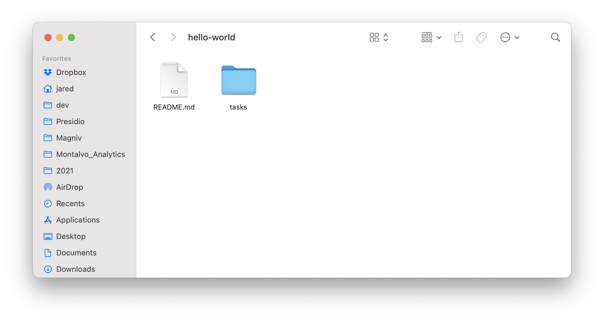
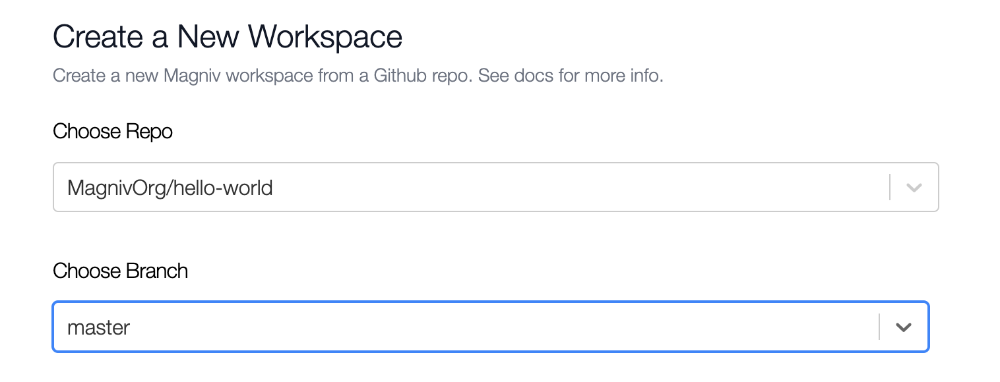

# Your First Workspace

This tutorial will walk you through setting up your first Magniv project. Welcome to the future ✨

## Requirements

Make sure you have installed [Magniv](../).

## Set up the repo

Magniv workspaces are generated from a pre-existing Github repo. We will start by setting up a new repo.


:::tip

Feel free to skip ahead and fork our [Hello World repo](https://github.com/MagnivOrg/hello-world) 🍴 

:::

### The `/tasks` folder

Let's create a folder called `tasks` at the root of our project. When building your workspace, Magniv will recursively find and productionize all tasks in this folder.



### Create `/tasks/requirements.txt`

Every Magniv project requires at least one `requirements.txt`. Each task you create will use the closest `requirements.txt`. Read more about how Magniv handles requirements in [File Structure](../documentation/file-structure).

For now, we only need `magniv` in our requirements file.

```jsx title="/tasks/requirements.txt"
magniv
```

## Creating a data task

We are finally ready to create and productionize our first data task!

All we need to do is create a Python function and decorate it with our [Magniv `@task` decorator](../documentation/task-decorator).

Let's create a file called `main.py` and import magniv.

```python title="/tasks/main.py"
from magniv.core import task

@task(schedule="@hourly")
def hello_world():
	print("Hello world")
```

## Testing our task

The easiest way to test our task is to run `main.py` directly. Let's just add two lines first to [call our function safely](https://www.geeksforgeeks.org/what-does-the-if-__name__-__main__-do/).

```python
if __name__ == '__main__':
	hello_world()
```

Now just run our file with `python tasks/main.py` to test that it works.

## Push to Github

Don't forgot to commit your new data task and push the Github repo!

```bash
$ git add .
$ git commit -m 'my first magniv task!'
$ git push
```

## Create a new Magniv workspace

Log into your Magniv account and click the "Create New Workspace" button on the top right. Use the dropdown to select our new Github repo.



_Please note: Workspaces take some time to set up, but we will email you when it is ready!_

## Recap

**🎉 Congratulations! In this getting started guide, you:**
1. Created a Magniv-compatible Github repo 
2. Wrote your first data task
3. Tested your data task
4. Scheduled and deployed your task to Magniv

# What's next?

Play around with the Magniv web-UI. Create some new data tasks and watch them automatically deploy.

- [Create a Slackbot using Magniv](slack-bot)
<!-- Add other docs here -->