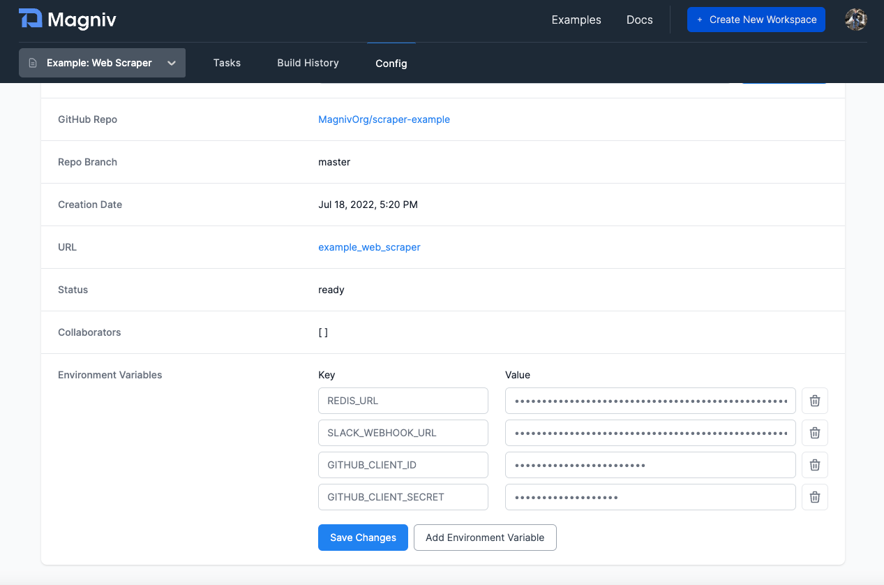

# Scraping GitHub Stargazers using Magniv

In this tutorial we will create a Magniv data application that gets the full GitHub profile of stargazers on GitHub repositories.

<div style={{position:"relative", paddingBottom:"62.5%", height:"0", marginBottom:"15px"}}><iframe src="https://www.loom.com/embed/002d77f02e294644aa680eec5d249e09" frameborder="0" webkitallowfullscreen mozallowfullscreen allowfullscreen style={{position:"absolute", top:"0", left:"0", width:"100%", height:"100%"}}></iframe></div>

:::tip

The code for this tutorial can be [found here](https://github.com/MagnivOrg/magniv-github).

:::


This example illustrates how Magniv allows you to:
1. Work with API that has a rate limit
2. Create a modular data application
3. Use Redis as an artifact store between Magniv tasks

## Stargazers

Stargazers is the name GitHub gives to people who have starred a repo:


[The GitHub API](https://docs.github.com/en/rest) allows you to get all the accounts of stargazers. You can then further use the GitHub API to get the full profile information of those users. This information can be used to calculate cool metrics about repositories and also create lists of GitHub users who have certain interests.

  
Given the sheer amount of stargazers for some repos and [GitHub's rate limits](https://docs.github.com/en/developers/apps/building-github-apps/rate-limits-for-github-apps) it is unrealistic to run this on a local machine, making scheduling it on the cloud with a platform like Magniv a great choice.

## Pre-Magniv Setup

Before you get started with Magniv you should:
- Create a [Github OAuth app](https://docs.github.com/en/developers/apps/building-oauth-apps/creating-an-oauth-app)
- Create a Redis instance you can connect to (we created one on [Render](https://render.com/))
- Create a Postgres DB you can connect to (we used [Railway](https://railway.app/) because they let you view the data quickly, Render can also work here)

## Task Architecture 

This scraper will consist of three different Magniv Tasks:
1. Task 1 will get the stargazers from a repo
2. Task 2 will take the stargazers and get their full profile information
3. Task 3 will clean those profiles and put them into a Postgres database

We will be using [Redis sets](https://redis.io/docs/manual/data-types/#sets) to keep track of all of our objects between the three tasks. This will act like an artifact store.


## Task 1: Prepare {#task1}

This task reads a Redis set that has the name of the repos that are to be scraped. For this tutorial we manually added repos to this set, but you can easily imagine creating an endpoint to allow anyone to add repos to this set.

We scheduled this task to run daily. It checks the Redis set `github_repos`, calls the GitHub API to get the stargazers and then adds them to another Redis set called `github_list`.
```python
@task(
    schedule="@daily",
    description="Get new repos from prepare list and add them to the github list",
)
def prepare():
    r = redis.from_url(os.environ.get("REDIS_URL"))
    next_repo = r.spop("github_repos")
    while next_repo:
        next_repo = next_repo.decode()
        users = []
        _get_star_gazers(
            next_repo,
            os.environ.get("GITHUB_CLIENT_ID"),
            os.environ.get("GITHUB_CLIENT_SECRET"),
            user_profiles=users,
        )
        f = "ghost_list/1_{}_.json".format(next_repo.replace("/", "_"))
        for user in users:
            user_info = {"github_info": user, "file": f}
            r.sadd("github_list", json.dumps(user_info))
        next_repo = r.spop("github_repos")

def _get_star_gazers(repo, client_id, client_secret, page=1, user_profiles=[]):
    url = "https://api.github.com/repos/{}/stargazers?per_page=100&page={}".format(
        repo, page
    )
    resp = requests.get(url, auth=(client_id, client_secret))
    if resp.status_code == 200:
        response = resp.json()
        user_profiles.extend(response)
        print(len(user_profiles))
        if len(response) < 100:
            # we are done
            print("we are done")
            return user_profiles
        else:
            print("we are going to the next page ", page)
            time.sleep(1)
            _get_star_gazers(
                repo,
                client_id,
                client_secret,
                page=page + 1,
                user_profiles=user_profiles,
            )
    else:
        print("failed --- page: ", page, " repo ", repo)
        # save
        return user_profiles

```

## Task 2: Collecting Profile Information

This next task takes the profiles from [Task 1](#task1) which are in the Redis set `github_list` and gets the full profile information by querying the GitHub API. It takes that response and adds it to the Redis set `finished_profiles`. 

The difficulty with this task is that GitHub rate limits your credentials to 5000 calls per an hour. To work around this we schedule the task for every two hours and continue popping from the Redis set until we get rate limited. 


```python
@task(
    schedule="0 */2 * * *",
    description="Get emails from the github_list on Redis and then add them to finished_profiles",
)
def get_email():
    r = redis.from_url(os.environ.get("REDIS_URL"))
    # first step is SPOP
    print("starting task ...")
    email_count = 0
    i = 0
    while True:
        i += 1
        profile = r.spop("github_list")
        if profile is not None:
            profile = profile.decode()
        else:
            break
        profile = json.loads(profile)
        resp = requests.get(
            profile["github_info"]["url"],
            auth=(
                os.environ("GITHUB_CLIENT_ID"),
                os.environ.get("GITHUB_CLIENT_SECRET"),
            ),
        )
        if resp.status_code == 200:
            response = resp.json()
            profile["github_user_profile"] = response
            r.sadd("finished_profiles", json.dumps(profile))
            if response["email"] is not None:
                email_count += 1
            time.sleep(0.3)
        elif resp.status_code == 404:
            pass
        else:
            r.sadd("github_list", json.dumps(profile))
            print("failed --- i ", i, email_count)
            print(resp.status_code)
            print(resp.json())
            # save
            break
```

## Task 3: Cleaning Up

The third Magniv task cleans up the profiles from the `finished_profiles` Redis set and adds them to a Postgres DB.

```python
@task(
    schedule="@daily",
    description="Task to clean up the finished_profiles redis set and move things into a DB",
)
def clean_redis_set():
    engine = create_engine(os.environ.get("DB_CONNECTION_STRING"))
    connection = engine.connect()
    r = redis.from_url(os.environ.get("REDIS_URL"))
    profile = r.spop("finished_profiles")
    while profile:
        profile = json.loads(profile.decode())
        # move this into the SQL DB
        try:
            _create_new_lead(
                connection,
                source_file=profile["file"],
                source_repo=_get_repo(profile["file"]),
                gh_login=profile["github_user_profile"]["login"],
                gh_id=profile["github_user_profile"]["id"],
                gh_name=profile["github_user_profile"]["name"],
                gh_email=profile["github_user_profile"]["email"],
                gh_twitter=profile["github_user_profile"]["twitter_username"],
                gh_public_repos=profile["github_user_profile"]["public_repos"],
                gh_followers=profile["github_user_profile"]["followers"],
                gh_created_at=profile["github_user_profile"]["created_at"],
                gh_updated_at=profile["github_user_profile"]["updated_at"],
                raw=json.dumps(profile),
            )
        except:
            print("failed on ", profile)
            r.sadd("finished_profiles_error", json.dumps(profile))
        profile = r.spop("finished_profiles")
    connection.close()


def _create_new_lead(
    connection,
    source_file=None,
    source_repo=None,
    gh_login=None,
    gh_id=None,
    gh_name=None,
    gh_email=None,
    gh_twitter=None,
    gh_public_repos=None,
    gh_followers=None,
    gh_created_at=None,
    gh_updated_at=None,
    raw=None,
):
    connection.execute(
        "insert into github_leads (source_file, source_repo, gh_login, gh_id, gh_name, gh_email, gh_twitter, gh_public_repos, gh_followers, gh_created_at, gh_updated_at, raw) values ('{}', '{}', '{}', '{}', '{}', '{}', '{}', {}, {}, '{}', '{}', '{}')".format(
            source_file,
            source_repo,
            gh_login,
            gh_id,
            gh_name,
            gh_email,
            gh_twitter,
            gh_public_repos,
            gh_followers,
            gh_created_at,
            gh_updated_at,
            raw,
        )
    )

def _get_repo(file_name):
    main_name = "_".join(file_name.split("/")[1].split("_")[1:])
    github_repo_name = "{}/{}".format(main_name.split("_")[0], main_name.split("_")[1])
    return github_repo_name
```

## Setting up ENV Variables

Once you have all your tasks and `requirements.txt` ready, push it all up to Magniv 🚀!

Check out [Your First Workspace](./getting-started) if you need help figuring out how to do that.

The last task we need to do is to set up the environment variables. 

Lucky that is pretty easy to do on Magniv! Just navigate to the config page of your workspace and scroll to the bottom. There you will be able to add all your environment variables.



Be sure to hit Save Changes 😊

Once you do that you are all done! 🎆
## Recap

**🎉 Congratulations! In this Github Scraper tutorial, you:**
1. Learned how Magniv can help you scrape data that is rate limited.
2. Built a modular Magniv data application that scrapes data reliably and with transparency. 
3. Deployed three tasks on Magniv that use Redis as an artifact store to pass data and Postgres to store cleaned data.

## What's next?

Enjoy your amazing data application that took you little effort; Magniv dealt with all the infrastructure headache.
Imagine all the projects you can do with ease of Magniv!

Feel free to fork [this repo](https://github.com/MagnivOrg/magniv-github) and adjust it to your needs
