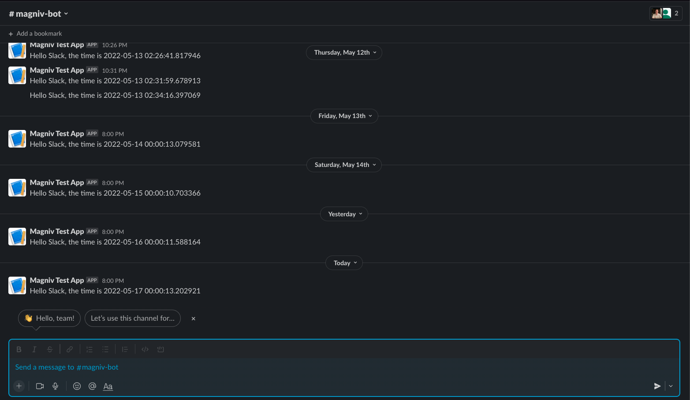

# Building a Slack Bot

Let's set up a Slack bot that notifies us regularly using Magniv. This could be used to monitor model status, analytics data, or maybe for BI-use cases.

## Requirements

Make sure you have installed [Magniv](../). 

## Set up the repo

As we saw in the [Your First Workspace Tutorial](getting-started), we start by setting up a Github repo with a `tasks` folder at its root. We will also start by creating a `slackbot.py` and `requirements.txt` inside our `/tasks` folder.

Let's also begin by setting up a [virtual environment](https://docs.python.org/3/library/venv.html) with `python3 -m venv .venv`. Make sure to pip install `magniv`. Activate your venv with `source .venv/bin/activate`

```bash
.venv
tasks
├── requirements.txt
└── slackbot.py
```

## Create our Magniv task

Let's start by building the Magniv task that will be run daily. From this task we can send a request to Slack's webhook

```python
from magniv.core import task
from datetime import datetime

@task(schedule="@daily")
def say_hi():
	message = "Hello Slack, the time is {}".format(datetime.now())
	# TODO: Send Slack message

if __name__ == '__main__':
	say_hi()
```

By using the `@task` decorator above, we tell Magniv to run the `say_hi` function on the provided schedule.

## Add in the Slack Webhook

Slack offers the ability for a Slack bot to send messages through incoming webhook requests. Follow the instructions on [Slack's documentation](https://api.slack.com/messaging/webhooks) to grab the webhook URL that you want to use.

I like to use the Python [requests library](https://docs.python-requests.org/en/latest/), so let's import it at the top. Don't forget to `pip install requests` in your virtual environment.

```python
import requests
```
 
Next, we will add a POST request to the Slack incoming webhook URL we retrieved above. Because we want this to be orchestrated by Magniv, it will go in our `say_hi()` function. Let's also add a print statement for logging purposes.

```python
@task(schedule="@daily")
def say_hi():
	message = "Hello Slack, the time is {}".format(datetime.now())
	req = requests.post(SLACK_WEBHOOK_URL, json={"text": message})
	print("Message sent:", message)
```

**Don't forget to update the `requirements.txt` with the libraries we used.** See more information on this process in our [FAQ](../faq/#how-do-i-create-a-requirementstxt)

```bash
$ pip freeze > tasks/requirements.txt
```

## Push to Github

Don't forgot to commit your new data task and push the Github repo!

```bash
$ git add .
$ git commit -m 'my first magniv slackbot!'
$ git push
```

## Deploy to Magniv

Now that we have written our Slack bot, let's [create a Magniv workspace](https://dashboard.magniv.io/create-workspace) to host it.


Once your Magniv workspace is set up, if everything went well, you should see the "say_hi" task in the tasks section of the Magniv dashboard.


Clicking on the task will show you more information and run history. To test it out feel free to click the button labeled "Manually run" at the bottom of the page. Once it finishes running, you should see a message in the Slack channel you designated!



## Recap

**🎉 Congratulations! In this Slackbot tutorial, you:**
1. Created a Magniv task that runs once a day
2. Created a Slack bot and used its incoming webhook URL to post
3. Learned how to navigate through the Magniv dashboard

# What's next?

Play around with the Magniv web-UI. Create some new data tasks and watch them automatically deploy.

<!-- Add other docs here -->